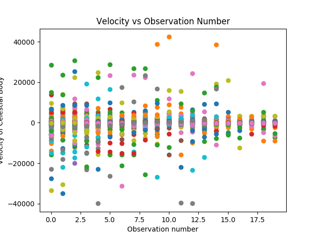

# CUBExoplanets
Colorado University of Boulder Data Science Team Exoplanets Dataset Analysis and Exploration
###Citations
* Butler, Vogt, Laughlin et al. 2017, AJ, in print

* KECK Data from <a href="http://home.dtm.ciw.edu/ebps/data/">here</a>

* ExoPlanet Data from <a href="http://exoplanetarchive.ipac.caltech.edu/cgi-bin/TblView/nph-tblView?app=ExoTbls&config=planets">here</a>

## Dependencies
* numpy
* matplotlib
Install with
~~~~
sudo pip install numpy matplotlib
~~~~

## KECK Data columns information 
Julian Date
Time the observation was taken
<table>
	<tr><td><b>Column Name</b></td><td><b>Description</b></td><td><b>Units</b></td></tr>
	<tr>
		<td>Velocity</td>
		<td>The velocity of the observed celestial body at the given time, given in m/s</td>
		<td>m/s</td>
	</tr><tr>
		<td>Uncertainty</td>
		<td>How accurate the velocity is +/-, in m/s</td>
		<td>m/s</td>
	</tr><tr>
		<td>S Value</td>
		<td>description goes here, -1 means the measurement couldn't have been made</td>
		<td>units go here</td>
	</tr><tr>
		<td>H Alpha</td>
		<td>desc here, -1 means the measurement couldn't have been made</td>
		<td>unit here</td>
	</tr><tr>
		<td>MPPX</td>
		<td>Median Photons per Pixel when Observed</td>
		<td>photons/pixel</td>
	</tr><tr>
		<td>Exposure Time</td>
		<td>How long the observation took</td>
		<td>seconds</td>
	</tr>
</table>
## Example graph
</img>
